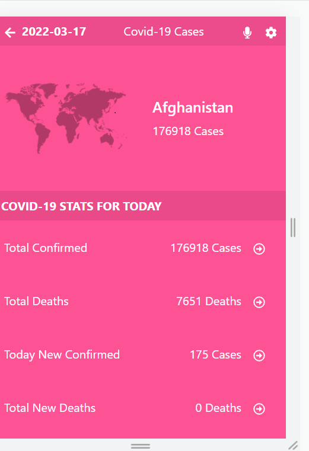

# Covid-19 Stats for Countries

> This is a web app which was built using  [Narrativa technology from the Data API](https://covid19tracking.narrativa.com/index_en.html) COVID-19 TRACKING PROJECT The Covid-19 Tracking Project collects information from different data sources to provide comprehensive data for the novel coronavirus, SARS-CoV-2.

## Built With

- React
- Redux
- Jest

## Live Demo 🚀

[Live Demo Link](https://danielufeli.github.io/react-metrics-webapp)

## Video presentation
[Video](https://www.loom.com/share/2b36ce2b4ffa41b0a4ca1f0eb290e72f)

## Getting Started

To get a local copy up and running follow these simple example steps.

### Prerequisites
Install Node and npm using the `npm install` command on your command line.

### Setup
Clone this repository by typing `git clone git@github.com:danielufeli/react-metrics-webapp.git` on your terminal.

### Install
Run `npm install` on your command line.

### Usage
Navigate to the project directory `cd react-metrics-webapp`, and run `npm start`. Or, you may view the live demo here: https://danielufeli.github.io/react-metrics-webapp

### Run tests
Run `npm test` on your command line.

## Author

👤 **Daniel Ufeli**

- GitHub: [@danielufeli](https://github.com/danielufeli)
- Twitter: [@danielufeli](https://twitter.com/danielufeli)
- LinkedIn: [LinkedIn](https://www.linkedin.com/in/danielcode/)

## 🤝 Contributing

Contributions, issues, and feature requests are welcome!

Feel free to check the [issues page](../../issues/).

## Show your support

Give a ⭐️ if you like this project!

## Acknowledgments

- Great Appreciations go to my code reviewers and partners at Microverse, for your support, advice and inspiration. Made according to design guidelines by [Nelson Sakwa on Behance](https://www.behance.net/gallery/31579789/Ballhead-App-%28Free-PSDs%29).

## 📝 License

This project is [MIT](./MIT.md) licensed.